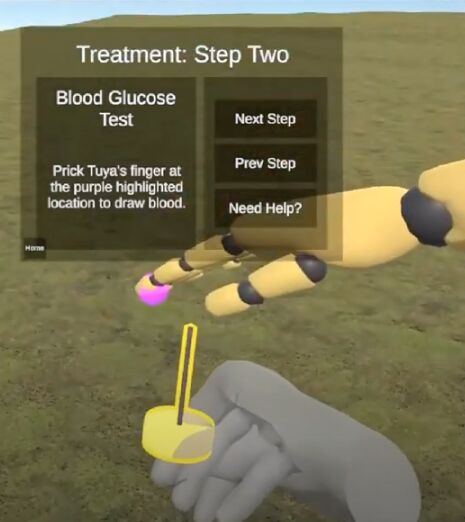

# CSE 165: 3D User Interfaces - Final Project

 

**Team 5:** Kevin Chan, Don Le, Alden Wu, Doris Zhong

**Abstract:** Chimeg's daughter, Tuya, has some unusual symptoms, but they do not have access to a doctor because Chimeg and her family follow a nomadic lifestyle in Mongolia. In order to diagnose and treat Tuya's possible health condition, Chimeg uses AILA. Therefore, AILA serves as a portable health assistant in place of a doctor. The goal of using AILA is to provide AR overlays and clear instructions to help guide Chimeg on how to take care of her daughter (although the prototype will be VR simulating real life). AILA primarily works through AR overlays over real life as a way to show and tell the user what to do next; the screen is interactable through simple gestures in order to navigate AILA's instructions and other information. AILA itself, as an AI assistant, is able to quickly calculate and determine problems and solutions. With regard to Chimeg's case, AILA is able to quickly diagnose Tuya's condition as Type-I Diabetes, and then proceeds to show Chimeg what to do next. The long-term impact is hopefully that all people will be able to have an AILA kit that can provide immediate aid when necessary.

**Technology:** Unity 3D, Meta Quest VR, OpenXR, C#

**Demo Video:** https://www.youtube.com/watch?v=ceNTVD5TJzo
